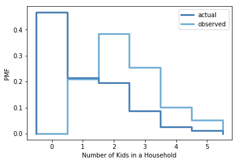

[Think Stats Chapter 3 Exercise 1](http://greenteapress.com/thinkstats2/html/thinkstats2004.html#toc31) (actual vs. biased)

We can generate the pmf and the bias pmf using the given Thinkstats2 functions:

```python
	resp = nsfg.ReadFemResp()
	pmf_numkdhh = thinkstats2.Pmf(resp.numkdhh, label='actual')
	biased_pmf_numkdhh = BiasPmf(pmf_numkdhh, label='observed')
```

And the plot of both PMFs:

```python
	thinkplot.PrePlot(2)
	thinkplot.Pmfs([pmf_numkdhh, biased_pmf_numkdhh])
	thinkplot.Config(xlabel='Number of Kids in a Household', ylabel='PMF')
```



The plot clearly shows us that in the biased distribution there are fewer households with less kids and more larger households. We can also calculate the means of the distributions:

```python
	print('Actual mean', pmf_numkdhh.Mean())
	print('Observed mean', biased_pmf_numkdhh.Mean())
```

The actual mean is 1.024 and the observed mean is 2.403, showing that the mean more than doubled.