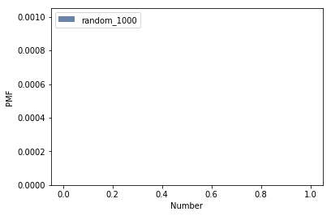
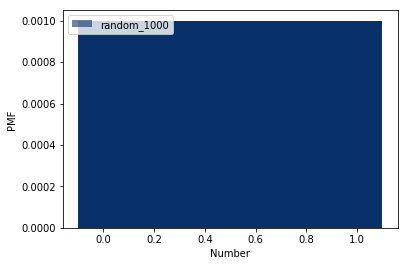
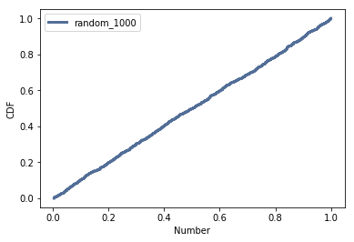

[Think Stats Chapter 4 Exercise 2](http://greenteapress.com/thinkstats2/html/thinkstats2005.html#toc41) (a random distribution)

We can first generate 1000 random numbers using np.random.random:

```python
	import numpy as np
	
	random_1000 = np.random.random(size=1000)
```

Then to generate the PMF and the CDF using the random numbers:

```python
	pmf_1000 = thinkstats2.Pmf(random_1000,label = 'random_1000')
	cdf_1000 = thinkstats2.Cdf(random_1000,label = 'random_1000')
```

Using these, we can generate a plot of both and see what happens. First we generate a plot of the PMF:

```python
	thinkplot.Hist(pmf_1000)
	thinkplot.Config(xlabel='Number', ylabel='PMF')
```



The plot of the PMF is blank; this is likely because the function Hist determines the width of the bins by looking at the minimum value between the two (unless a binning option is given). However, since the values are so infinitestimal, without an option given the plot will not render. We can try with binning option to get a clearer picture:

```python
	# Plot the PMF now with a bin option
	thinkplot.Hist(pmf_1000,width=0.2)
	thinkplot.Config(xlabel='Number', ylabel='PMF')
```



Now we can see that the distribution is normal since the spread is pretty much identical. Now  we take a look at the plot of the CDF:

```python
	thinkplot.Cdf(cdf_1000)
	thinkplot.Config(xlabel='', ylabel='CDF')
```



As we can see, the distribution of the CDF is uniform.